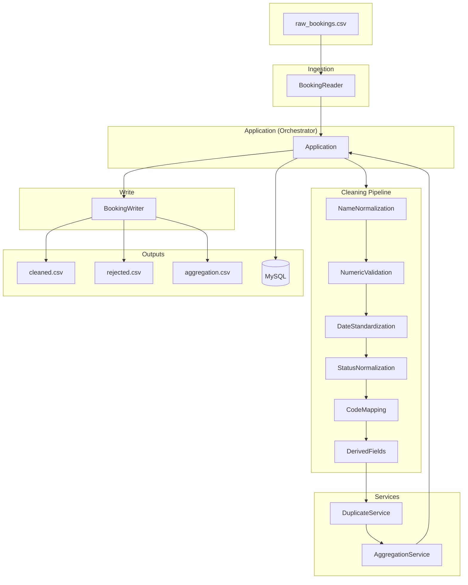

# Bus Reservation – System Design

This document describes the high-level architecture, components, data flow, and design decisions of the Bus Data Cleaning Pipeline.

---

## 1. Overview

### 1.1 Purpose

The system is a **batch data-cleaning pipeline** that:

- Ingests raw bus booking data from **CSV**
- Validates, normalizes, and enriches each record through a **configurable rule pipeline**
- Removes **duplicates** (by booking ID or composite key)
- Persists cleaned data and route-wise **aggregations** to **MySQL** (optional)
- Writes **output CSVs**: cleaned records, rejected records (with reasons), and aggregation summary

### 1.2 Execution Model

- **Batch job**: Single run (no scheduler; invoked via CLI or IDE).
- **Single-threaded**: One record at a time through the pipeline; no parallel processing.
- **Configuration**: File-based (`application.properties`); no runtime API.

---

## 2. High-Level Architecture

```
┌─────────────────────────────────────────────────────────────────────────────┐
│                              APPLICATION (Entry Point)                       │
│                              com.bus.cleaning.app.Application                │
└─────────────────────────────────────────────────────────────────────────────┘
                                          │
         ┌────────────────────────────────┼────────────────────────────────┐
         ▼                                ▼                                ▼
┌─────────────────┐            ┌─────────────────┐            ┌─────────────────┐
│   CONFIG        │            │   REPOSITORY     │            │   SERVICE       │
│   AppConfig     │            │   (I/O)          │            │   (Business     │
│   DbConfig      │            │   Reader/Writer  │            │    Logic)       │
└─────────────────┘            └─────────────────┘            └─────────────────┘
         │                                │                                │
         │                        ┌───────┴───────┐                        │
         │                        ▼               ▼                        │
         │                 CSV Reader/Writer   DB Repos                   │
         │                 (files)             (MySQL)                    │
         │                        │               │                        │
         └────────────────────────┴───────────────┴────────────────────────┘
                                          │
                                          ▼
┌─────────────────────────────────────────────────────────────────────────────┐
│   MODEL: Booking (raw + cleaned fields + valid/invalidReason)                │
└─────────────────────────────────────────────────────────────────────────────┘
```

---

## 3. Component Diagram

```
                    ┌──────────────────┐
                    │   Application    │
                    │   (orchestrator) │
                    └────────┬────────┘
                             │
     ┌───────────────────────┼───────────────────────┐
     │                       │                       │
     ▼                       ▼                       ▼
┌─────────────┐      ┌──────────────┐      ┌─────────────────┐
│ AppConfig   │      │ BookingReader │      │ CleaningPipeline │
│ DbConfig    │      │ BookingWriter │      │ (list of rules)  │
└─────────────┘      └──────┬───────┘      └────────┬────────┘
                            │                       │
              ┌─────────────┼─────────────┐         │
              ▼             ▼             ▼         ▼
     ┌─────────────┐ ┌─────────────┐ ┌─────────┐  │ CleaningRule[]
     │CsvBooking   │ │CsvBooking   │ │DbBooking│  │  ├─ NameNormalizationRule
     │Reader       │ │Writer       │ │Repository│  │  ├─ NumericValidationRule
     └─────────────┘ └─────────────┘ └─────────┘  │  ├─ DateStandardizationRule
              │             │             │        │  ├─ StatusNormalizationRule
              │             │             │        │  ├─ CodeMappingRule
              │             │             │        │  └─ DerivedFieldsRule
              ▼             ▼             ▼        └─────────────────────────┘
         [CSV file]   [CSV files]   [MySQL]              │
                                                        ▼
                                              ┌─────────────────┐
                                              │ DuplicateService│
                                              │ AggregationSvc  │
                                              └─────────────────┘
```

---

## 4. Data Flow

### 4.1 End-to-End Flow (Sequence)

```
  CSV (input)     Application      Pipeline      DuplicateService   DB (optional)   CSV (output)
       │               │                │                │                │              │
       │  readAll()    │                │                │                │              │
       │──────────────>│                │                │                │              │
       │   List<Booking>                │                │                │              │
       │               │  process(b)    │                │                │              │
       │               │───────────────>│  apply each    │                │              │
       │               │  (per record)  │  rule         │                │              │
       │               │<───────────────│  (mutate b)   │                │              │
       │               │  valid/invalid │                │                │              │
       │               │  split         │                │                │              │
       │               │  removeDuplicates(valid)        │                │              │
       │               │───────────────────────────────>│                │              │
       │               │  unique valid  │                │                │              │
       │               │<───────────────────────────────│                │              │
       │               │  saveAll(valid)                │                │              │
       │               │───────────────────────────────────────────────>│              │
       │               │  routeWiseSummary(valid)        │                │              │
       │               │  saveAll(aggregation)           │                │              │
       │               │───────────────────────────────────────────────>│              │
       │               │  writeCleaned / writeRejected / writeAggregation  │              │
       │               │─────────────────────────────────────────────────────────────>│
       │               │                │                │                │   cleaned.csv
       │               │                │                │                │   rejected.csv
       │               │                │                │                │   aggregation.csv
```

### 4.2 Pipeline Order (Rules)

Rules are applied in a **fixed order**; later rules may depend on earlier ones (e.g. `DerivedFieldsRule` uses `ageValue`, `fareValue` set by `NumericValidationRule`).

| Order | Rule | Responsibility |
|-------|------|----------------|
| 1 | NameNormalizationRule | Trim, proper case; reject missing/invalid name |
| 2 | NumericValidationRule | Parse age (0–100), fare (≥0); set ageValue, fareValue |
| 3 | DateStandardizationRule | Parse date → travelDateStd (yyyy-MM-dd) |
| 4 | StatusNormalizationRule | Normalize status → CONFIRMED / CANCELLED |
| 5 | CodeMappingRule | Map routeCode → routeName (RT1–RT6) |
| 6 | DerivedFieldsRule | Set ageCategory, fareCategory from ageValue/fareValue |

Each rule may call `booking.addReason(...)` and set `booking.valid = false`. No rule removes reasons; they accumulate.

### 4.3 Duplicate Handling

- **Primary key**: `bookingId` (if non-empty after trim).
- **Composite key** (when bookingId empty): `passengerName|busCode|routeCode|travelDateStd` (normalized).
- **Strategy**: First occurrence wins; later duplicates are dropped (order preserved via `LinkedHashMap`).

---

## 5. Module / Layer Breakdown

| Layer | Package | Responsibility |
|-------|---------|----------------|
| **App** | `com.bus.cleaning.app` | Entry point; loads config; wires reader, pipeline, services, writer; runs steps 1–5 |
| **Config** | `com.bus.cleaning.config` | AppConfig (paths, DB flags, credentials), DbConfig (JDBC connection) |
| **Model** | `com.bus.cleaning.model` | Booking: raw fields, cleaned fields, valid/invalidReason, CSV row formatters |
| **Rules** | `com.bus.cleaning.rules` | CleaningRule interface; six implementations (validation + normalization) |
| **Service** | `com.bus.cleaning.service` | CleaningPipeline (apply rules), DuplicateService (dedup), AggregationService (route summary) |
| **Repository** | `com.bus.cleaning.repository` | BookingReader/Writer (CSV/DB); SchemaInitializer; DB table creation & upsert |

Dependencies flow **inward**: App → Config, Repository, Service, Rules; Service → Model; Rules → Model; Repository → Model, Config.

---

## 6. Data Model

### 6.1 Booking (In-Memory)

| Field | Type | Description |
|-------|------|-------------|
| bookingId, passengerName, age, gender, busCode, routeCode, travelDate, fare, status | String | Raw input (may be mutated by rules, e.g. passengerName, status) |
| ageValue, fareValue | Integer, Double | Parsed/normalized (set by NumericValidationRule) |
| travelDateStd | String | Standardized date yyyy-MM-dd |
| routeName | String | Mapped from routeCode (CodeMappingRule) |
| ageCategory, fareCategory | String | Derived (Minor/Adult/Senior; Low/Medium/High) |
| valid | boolean | False if any rule called addReason |
| invalidReason | String | Concatenated reasons (e.g. "InvalidAgeFormat\|MissingName") |

### 6.2 AggregationRow (DTO)

| Field | Type |
|-------|------|
| routeName | String |
| totalBookings | int |
| totalRevenue | double |
| confirmedCount | int |
| cancelledCount | int |

Sorted by `totalRevenue` descending before write.

### 6.3 CSV Schema

**Input** (min 9 columns):  
`BookingID, PassengerName, Age, Gender, BusCode, RouteCode, TravelDate, Fare, Status`

**Output – Cleaned**:  
Same semantic fields plus: `RouteName, AgeCategory, FareCategory` (standardized date in TravelDate column).

**Output – Rejected**:  
Same as cleaned plus: `Reason` (invalidReason).

**Output – Aggregation**:  
`RouteName, TotalBookings, TotalRevenue, ConfirmedCount, CancelledCount`

### 6.4 Database Schema

**booking**

| Column | Type | Notes |
|--------|------|-------|
| booking_id | VARCHAR(50) | PK |
| passenger_name | VARCHAR(100) | |
| age | INT | |
| gender | VARCHAR(10) | |
| bus_code | VARCHAR(50) | |
| route_code | VARCHAR(50) | |
| route_name | VARCHAR(100) | |
| travel_date | DATE | |
| fare | DECIMAL(10,2) | |
| status | VARCHAR(30) | |
| age_category | VARCHAR(30) | |
| fare_category | VARCHAR(30) | |

Upsert: `ON DUPLICATE KEY UPDATE` on `booking_id`.

**booking_aggregation**

| Column | Type | Notes |
|--------|------|-------|
| route_name | VARCHAR(100) | PK |
| total_bookings | INT | |
| total_revenue | DECIMAL(12,2) | |
| confirmed_count | INT | |
| cancelled_count | INT | |

Upsert: `ON DUPLICATE KEY UPDATE` on `route_name`.

---

## 7. Design Patterns and Decisions

| Pattern / Decision | Where | Rationale |
|--------------------|--------|-----------|
| **Pipeline** | CleaningPipeline + list of CleaningRule | Sequential validation/normalization; easy to add/order rules |
| **Strategy-like rules** | CleaningRule implementations | Each rule encapsulates one concern; same interface |
| **Repository (interface)** | BookingReader, BookingWriter | Swap CSV vs DB or other storage without changing orchestration |
| **DTO** | Booking, AggregationRow | Clear in-memory and output shape; no ORM |
| **Configuration object** | AppConfig | Single load from properties; passed to DB and paths |
| **Mutable record** | Booking passed through pipeline | Rules mutate one object; no copy per rule; simple and fast for batch |

---

## 8. External Systems

| System | Role | Optional |
|--------|------|----------|
| **File system** | Input CSV path; output paths for cleaned, rejected, aggregation | No (paths required) |
| **MySQL** | Persist booking + booking_aggregation; SchemaInitializer for DB/table creation | Yes (db.enabled=false) |

No message queues, caches, or external APIs.

---

## 9. Configuration

- **Source**: `src/main/resources/application.properties` (and copy in `target/classes` after build).
- **Keys**: `input.path`, `output.cleaned`, `output.rejected`, `output.aggregation`, `db.enabled`, `db.url`, `db.username`, `db.password`.
- **Load**: Once at startup via `AppConfig.load()` (classpath resource).

---

## 10. Deployment / Execution

- **Build**: Maven (`mvn clean compile`).
- **Run**: `mvn compile exec:java -Dexec.mainClass="com.bus.cleaning.app.Application"` or run `Application` main from IDE. Working directory = project root (paths in properties are relative).
- **Tests**: JUnit 5; `mvn test`. No separate test config; same code paths as production for pipeline and services.

---

## 11. Non-Functional Aspects

- **Logging**: Log4j 2; INFO for steps and counts, WARN for validation failures (per booking).
- **Error handling**: Exceptions propagate (e.g. missing file, DB failure); no retry or dead-letter. Invalid records are marked invalid and written to rejected CSV.
- **Idempotency**: Re-running overwrites output files and upserts DB rows (same booking_id / route_name).
- **Scalability**: Single process, single thread; suitable for small/medium CSV sizes. For very large files, consider streaming or chunking (not implemented).

---

## 12. Summary Diagram (Mermaid)

The diagram shows top-down flow: **Input** → **Ingestion** → **Application** → **Cleaning Pipeline** (rules in order) → **DuplicateService** → **AggregationService** → **Application** → **BookingWriter** and **MySQL** → **Outputs**.



### Export to PDF

A standalone Mermaid file is provided for clean export to PDF or PNG:

- **File:** `docs/system-design-diagram.mmd` (includes styling and comments)

**Option A – Mermaid CLI (recommended for PDF):**

```bash
# Install once (requires Node.js)
npm install -g @mermaid-js/mermaid-cli

# From project root: generate PDF
mmdc -i docs/system-design-diagram.mmd -o docs/system-design-diagram.pdf

# Or PNG
mmdc -i docs/system-design-diagram.mmd -o docs/system-design-diagram.png
```

**Option B – Mermaid Live Editor:**

1. Open [https://mermaid.live](https://mermaid.live).
2. Paste the contents of `docs/system-design-diagram.mmd` (or the code block above).
3. Use **Actions → Export → PDF** (or PNG/SVG).

---

This document reflects the current codebase and can be updated when new components or flows are added.
