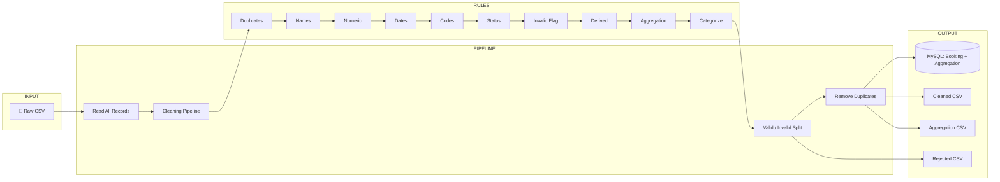

# Capgemini Sprint – Bus Reservations | 5-Slide PPT Content

**For client presentation.** Keep each slide to a few short bullets; expand only if the client asks. Use Capgemini branding below for a consistent, on-brand deck.

Based on *Bus_Full.docx* (Data Cleaning & Transformation Use Cases). Copy each section into one slide. Use the flow diagram as Slide 3; you can redraw it in PowerPoint or paste the Mermaid export as an image (see note at the end).

---

## Capgemini branding (colors, font, logo)

Use these for a consistent, on-brand PPT.

### Colors

| Use for | Name | HEX | RGB |
|--------|------|-----|-----|
| **Primary** (headers, key elements, logo) | Capgemini Blue | **#0070AD** | 0, 112, 173 |
| **Accent** (highlights, links, diagrams) | Vibrant Blue | **#17ABDA** | 23, 171, 218 |

**In PowerPoint:**  
- Set theme colors: Primary = `#0070AD`, Accent = `#17ABDA`.  
- Use Capgemini Blue for titles and main shapes; Vibrant Blue for bullets, arrows, and accents.  
- Background: white `#FFFFFF` or very light grey. Text: dark grey/black for body.

### Font

- **Titles / headings:** **Arial Bold** or **Arial Black** (clean, corporate; matches common Capgemini decks).  
- **Body / bullets:** **Arial** or **Arial Regular**, 18–24 pt for body, 24–32 pt for titles.  
- Official guidelines reference a custom wordmark for the logo; for slide text, Arial is the safe, widely used choice in Capgemini materials.  
- If your team has a brand pack, prefer the font specified there (e.g. a custom sans-serif).

### Logo

- **Official source:** [Capgemini Visual Identity](https://visualidentity.capgemini.com) (login may be required for full asset library).  
- **For quick use:** Download PNG/SVG from [SeekLogo – Capgemini](https://seeklogo.com/vector-logo/25892/capgemini) or [BrandLogoVector – Capgemini](https://brandlogovector.com/capgemini-logo-vector/).  
- **Placement:** Top-left or top-right of title slide; smaller on subsequent slides (e.g. corner).  
- **Versions:** Use **blue logo** on white/light slides; use **white logo** on blue (`#0070AD`) backgrounds.

---

## SLIDE 1 — Title & Problem

**Title:** Bus Reservations – Data Cleaning & Transformation

**Subtitle:** Transforming raw reservation data into reliable, actionable insights

**Problem (2 bullets):**
- Raw bus reservation data has inconsistent names, dates, statuses, codes, and invalid or duplicate records
- Need a reliable Core Java pipeline to clean, validate, transform, and load data for reporting and DB

**Execution in one line:**  
End-to-end pipeline: CSV in → clean, transform, deduplicate → cleaned + rejected + aggregation out (+ optional MySQL).

**Visual:** Use one strong image (bus/transport + data or dashboard).

---

## SLIDE 2 — Solution Delivered / What We Built

**Title (choose one):**
- **Solution Delivered** *(recommended — professional)*
- **What We Delivered**
- **Our Deliverable**

**Opening paragraph (2–3 sentences):**

We delivered an end-to-end **Bus Reservations Data Pipeline** in Core Java that ingests raw CSV data, runs it through a configurable cleaning and transformation engine, and produces cleaned datasets alongside rejected records and aggregations—with optional persistence to MySQL. The solution is designed for reliability and auditability: every invalid record is flagged and written to a separate file, while valid data flows into cleaned outputs and the database. The pipeline implements **10 cleaning and transformation rules**, each delivered as a focused, testable component.

---

**Delivered components — 10 rules (one line each):**

1. **Remove Duplicates** — Unique records by ID (Set-based).
2. **Normalize Names** — Trim and proper case.
3. **Fix Numeric Fields** — Parse, validate, reject invalid.
4. **Standardize Dates** — Single format (yyyy-MM-dd).
5. **Map Codes** — Short codes → full labels (Map lookup).
6. **Validate Status** — Normalize to fixed set (e.g. CONFIRMED, CANCELLED).
7. **Flag Invalid Records** — Log and output to rejected list.
8. **Derived Fields** — New columns from existing data.
9. **Aggregation** — Group by route/date; summary metrics.
10. **Data Categorization** — Assign to category buckets.

**Testing** — Unit tests cover the pipeline and cleaning rules; every Maven build runs the test suite so releases are validated before deploy.

**Visual:** Screenshot of output files (cleaned.csv, rejected.csv, aggregation.csv) or a sample of transformed data.

---

## SLIDE 3 — Full Process Flow Diagram

**Title:** End-to-End Process Flow

**5 key points (use as bullets on the slide):**

1. **Ingest** — Raw reservation CSV is read in full; every row is loaded for processing.
2. **Clean & Transform** — A configurable pipeline applies 10 rules (names, dates, codes, status, numerics, derived fields, etc.) and marks each record as valid or invalid.
3. **Split** — Valid records are separated from invalid ones; invalid rows are written to a rejected file for audit.
4. **Deduplicate** — Duplicate records (by ID) are removed from the valid set so only unique bookings remain.
5. **Output** — Cleaned data is written to cleaned CSV, aggregation CSV, and optionally to MySQL (booking + aggregation tables); rejected records go to rejected CSV.

**Use the diagram below in one of these ways:**
1. **PowerPoint:** Redraw using shapes (rectangles for steps, arrows between them).
2. **Image:** Go to [mermaid.live](https://mermaid.live), paste the Mermaid code, export as PNG/SVG, insert in PPT.

---

### Option A – Mermaid (for image export)



---

### Option B – Text flow (copy-paste into PPT as-is)

```
┌─────────────┐     ┌──────────────────┐     ┌─────────────────────────────┐
│  RAW CSV    │────▶│  READ ALL         │────▶│  CLEANING PIPELINE          │
│  (Input)    │     │  RECORDS          │     │  • Name normalization       │
└─────────────┘     └──────────────────┘     │  • Numeric validation       │
                                             │  • Date standardization     │
                                             │  • Status normalization     │
                                             │  • Code mapping             │
                                             │  • Derived fields           │
                                             └──────────────┬──────────────┘
                                                            │
                                                            ▼
┌─────────────┐     ┌──────────────────┐     ┌─────────────────────────────┐
│ AGGREGATION │◀────│  MYSQL (if on)   │◀────│  REMOVE DUPLICATES          │
│ CSV         │     │  • Booking table  │     │  (valid records only)       │
└─────────────┘     │  • Aggregation    │     └──────────────┬──────────────┘
                    └──────────────────┘                    │
┌─────────────┐     ┌──────────────────┐                    │
│ REJECTED    │◀────│  VALID / INVALID │◀────────────────────┘
│ CSV         │     │  SPLIT           │
└─────────────┘     └──────────────────┘
┌─────────────┐
│ CLEANED CSV │◀──── (unique valid records)
└─────────────┘
```

---

### Option C – Simple linear (for quick PPT shapes)

**Step 1** → **Step 2** → **Step 3** → **Step 4** → **Step 5**

| Step | Name                | What happens                                      |
|------|---------------------|---------------------------------------------------|
| 1    | Read                | Load all rows from input CSV                      |
| 2    | Cleaning pipeline   | Apply 10 rules; set valid/invalid per record     |
| 3    | Split               | Valid list vs rejected list                       |
| 4    | Deduplicate         | Remove duplicates from valid list                |
| 5    | Output              | Save to MySQL (if enabled) + cleaned/rejected/aggregation CSVs |

---

### Option D – One-line flow (paste into PPT, then draw boxes)

```
[Raw CSV] → [Read] → [Clean: 10 rules] → [Valid/Invalid] → [Deduplicate] → [MySQL + Cleaned CSV + Rejected CSV + Aggregation CSV]
```

**Box labels for PPT shapes:**  
1. Raw CSV  
2. Read records  
3. Cleaning pipeline (10 rules)  
4. Valid / Invalid split  
5. Deduplicate  
6. Output: DB + 3 CSVs  

---

## SLIDE 4 — Execution & Demo

**Title:** How to Run & What You Get

*Keep bullets short for the client; you can run the job live if needed.*

- **Build** — Single command builds and tests the application and produces a runnable JAR.
- **Run** — One command starts the pipeline; the console shows progress: records read, valid vs rejected, deduplication.
- **Results** — Three output files: **Cleaned CSV** (ready for reporting), **Rejected CSV** (audit trail for invalid rows), **Aggregation CSV** (metrics by route/date). Optional: data can also be loaded into MySQL.
- **Takeaway** — Every input record is accounted for: either in the cleaned/output set or in the rejected file with full traceability.


---

## SLIDE 5 — DevOps

**Title:** DevOps & Release

*Client-facing bullets — short and benefit-focused. Use the “Presenter note” below if they ask for detail.*

- **Build** — We use **Maven** to build, test, and package the application in a single, repeatable step. Every build is consistent and traceable.
- **Artifact repository** — **Nexus** stores every build by version. Development builds (snapshots) and release builds are kept separate so you always know which version is in use or handed over.
- **Deploy** — One command publishes the built artifact to Nexus. Release versions go to the release repository; development versions go to the snapshot repository. No manual uploads; full audit trail.
- **Code quality** — **SonarQube** is integrated for static analysis: code quality, test coverage, and duplication reports. Quality gates can be part of the release process.
- **Takeaway** — Build, store, and release are automated and version-controlled; code quality is checked before release.

---

**Presenter note (if client asks “how”):**  
Maven is configured with `distributionManagement` in `pom.xml` (Nexus URLs) and credentials in `~/.m2/settings.xml`. Run `mvn clean deploy` to publish; run `mvn sonar:sonar` for SonarQube. Nexus can be run locally via Docker (`sonatype/nexus3` on port 8081). Repos: **maven-snapshots** (SNAPSHOT versions), **maven-bus** (release versions).


---

## SLIDE 6 — Summary & Next (if you need 6th slide)

**Title:** Summary & Next Steps

**What we delivered**
- End-to-end Bus Reservations data pipeline: ingest → clean → transform → deduplicate → outputs (CSV + optional MySQL).
- 10 cleaning and transformation rules; duplicate handling; aggregation and full audit trail for rejected data.
- Testing: unit tests for the pipeline and rules; tests run on every build so releases are validated.
- DevOps: Maven build, Nexus for versioned artifacts, SonarQube for code quality.

**Next (optional)**
- CI pipeline (e.g. GitHub Actions): build → test → SonarQube → deploy to Nexus.
- Docker image for the application for easy deployment.

*Optional visual:* Team/sprint photo or “Thank you”.

---

## Diagram note for PPT

- **Full process diagram:** Use **Slide 3** content; pick Option A (Mermaid → export image), Option B (text flow), or Option C (table + shapes).
- For **Mermaid:** Copy the code from Option A into [mermaid.live](https://mermaid.live) → Export as PNG or SVG → Insert image in PPT.
